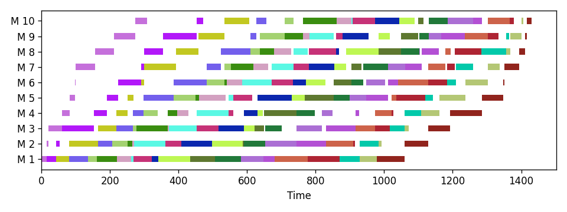

# bnbpy


A generic, configurable Python framework for solving optimization problems
using Branch & Bound. Also supports Column Generation and Branch & Price.

[Configure](#configuration) | [Usage](#usage) | [Base Problems](#base-problems) | [Development](#development) | [Contact](#contact)

See more examples in the [notebooks folder](./notebooks/):

- [Single Machine Scheduling](./notebooks/single-machine.ipynb)
- [Permutation Flow Shop](./notebooks/pfssp.ipynb) (main focus so far)
- [Permutation Assembly Flow Shop](./notebooks/pafssp.ipynb) (main focus so far)
- [MILP](./notebooks/milp.ipynb)
- [Cutting Stock](./notebooks/cutting-stock.ipynb)
- [Graph Coloring](./notebooks/graph-coloring-bak.ipynb)
- [Lot Sizing](./notebooks/lot-size.ipynb)

## Configuration

### Installation

Install the package and its dependencies via pip from the root of the repository:

```
python -m pip install .
```

To include development resources for running `bnbprob`, tests, and linters, use the `dev` extra:

```
python -m pip install .[dev]
```

For editable (development) mode, which allows you to track changes in the source files:

```
python -m pip install -e .[dev]
```

All package dependencies and metadata are specified in [setup.cfg](./setup.cfg). Build requirements and extension settings are in [pyproject.toml](./pyproject.toml).

### Building

To build Cython extensions, run:

```
python setup.py build_ext --inplace
```

Be aware of deprecated commands in `setup.py`. See [here](https://packaging.python.org/en/latest/discussions/setup-py-deprecated/#needs-build) for more information.

To build wheels for distribution, run:

```
python -m build --wheel
```

## Usage

### Branch & Bound

```python
from bnbpy import BranchAndBound, Problem

class MyProblem(Problem):
    # Define your problem specifications by implementing abstract methods

    def calc_bound(self):
        # Compute node lower bound
        pass

    def is_feasible(self):
        # Verify if node is feasible in the complete problem
        pass

    def branch(self):
        # Return a list of subproblems if not fathomed
        pass

# Apply Branch & Bound
problem = MyProblem()
bnb = BranchAndBound()
bnb.solve(problem)
print(bnb.solution)
```

### Branch & Price

```python
import bnbpy as bbp

class MyMaster(bbp.Master):
    def __init__(self, *args):
        # Implement your master problem
        pass

    def add_col(self, c) -> bool:
        # Include a new column and return True if accepted
        return True

    def solve(self) -> bbp.MasterSol:
        # cost = ...
        # duals = ...
        # return MasterSol(cost=cost, duals=duals)
        pass

class MyPricing(bbp.Pricing):
    def __init__(self, **kwargs):
        super().__init__(**kwargs)
        # Instantiate your pricing problem

    def set_weights(self, c):
        # Modify the instance by incorporating new weights
        pass

    def solve(self) -> bbp.PriceSol:
        # red_cost = ...
        # new_col = ...
        # return PriceSol(red_cost=red_cost, new_col=new_col)
        pass

class MyCG(bbp.ColumnGenProblem):
    def __init__(self, **kwargs):
        master = MyMaster()
        pricing = MyPricing(**kwargs)
        super().__init__(
            master=master,
            pricing=pricing,
        )

    def branch(self) -> list['MyCG'] | None:
        # Create children
        pass

    def is_feasible(self) -> bool:
        # Check for feasibility in the complete formulation
        pass
```

## Base Problems

The `bnbprob` package incorporates elements of `bnbpy` to solve classical examples.
It is installed alongside `bnbpy`.

See examples for [MILP](#milp), [Flow Shop](#flow-shop), and [Graph Coloring](#graph-coloring) problems below.

### MILP

The MILP implementation is based on `scipy.optimize.linprog` for solving LPs.

```python
import numpy as np

from bnbprob.milpy import MILP
from bnbpy import BranchAndBound

# Simple problem
c = np.array([-5.0, -4.0])

A_ub = np.array([
    [2.0, 3.0],
    [2.0, 1.0]
])
b_ub = np.array([12.0, 6.0])

milp = MILP(c, A_ub=A_ub, b_ub=b_ub)
bfs = BranchAndBound()
sol = bfs.solve(milp)
print(f"Sol: {sol} | x: {sol.x}")
# >>> Sol: Status: OPTIMAL | Cost: -18.0 | LB: -18.0 | x: [2. 2.]
```

### Flow Shop

In this example, an instance from the literature with 20 jobs on 10 machines is solved.
It takes less than 1 second, which is an impressive performance even compared to the best commercial MILP solvers.

```python
import json
from bnbprob.pafssp import CallbackBnB, PermFlowShop, plot_gantt

with open("./data/flow-shop/reC11.json", mode="r", encoding="utf8") as f:
    p = json.load(f)

problem = PermFlowShop.from_p(p, constructive='neh')
bnb = CallbackBnB(
    eval_node='in', rtol=0.0001, save_tree=False
)

# The commercial solver Gurobi took 600s (timeout) to find the near-optimal
# solution 1432
sol = bnb.solve(
    problem, maxiter=1000000, timelimit=600
)
print(sol)
# >>> Status: OPTIMAL | Cost: 1431 | LB: 1431

plot_gantt(sol.sequence, figsize=[8, 3])
```



### Graph Coloring

To illustrate the usability of the Branch & Price feature, the implementation
of Graph Coloring outperforms commercial solvers with basic MILP modeling.

```python
from bnbprob import gcol
from bnbpy import BranchAndBound

# Instances are available in the 'data' folder
instance = gcol.load_instance("./data/gcol/gcol_70_7.txt")

# Solve a 70-node instance to optimality in 24s
# With only heuristics to generate columns, it took only 14s
# The commercial solver Gurobi took 81s to find the optimal solution
# but could only prove optimality within 51 min
bnb = BranchAndBound()
price_tol = 0.1
pricing = gcol.ColorHybrPricing(
    instance["edges"],
    heur=gcol.TargetMultiStart(
        12, price_tol + 1, 20, 200
    ),
    price_tol=price_tol
)
problem = gcol.ColGenColor(
    instance['edges'],
    pricing=pricing,
    max_iter_price=1000,
)
sol = bnb.solve(problem, maxiter=1000)
print(sol)
# >>> Status: OPTIMAL | Cost: 17 | LB: 17
```

## Development

### Code Quality

This project uses [Ruff](https://docs.astral.sh/ruff/) as a linter and [Mypy](https://mypy-lang.org/) as a static type checker. Both are configured in [pyproject.toml](./pyproject.toml).

```
mypy src/
```

```
ruff check src/
```

### Tests

Tests are configured in [pyproject.toml](./pyproject.toml). The package `pytest` is used as the main framework. To run tests, execute:

```
pytest
```

To track code coverage of the main package `bnbpy`, run:

```
pytest --cov=bnbpy --cov-report=html
```

Most of the package is already cythonized, so the coverage loses its meaning when raw.

## Contact

Reach out to me at `bruscalia12@gmail.com` if you have any questions.
