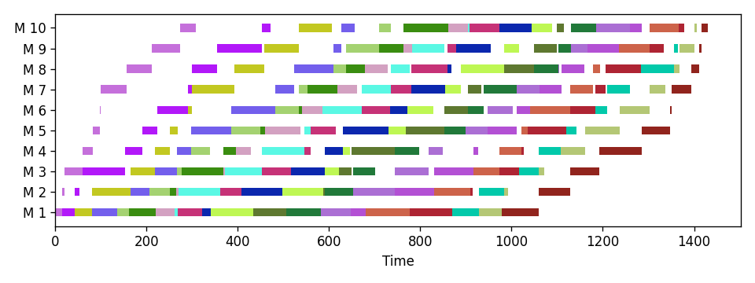

Examples
========

The ``bnbprob`` package incorporates elements of ``bnbpy`` to solve classical optimization problems. It is installed alongside ``bnbpy``.

The examples below demonstrate solving:

* :ref:`milp-example` - Mixed Integer Linear Programming
* :ref:`flow-shop-example` - Permutation Flow Shop Scheduling
* :ref:`graph-coloring-example` - Graph Coloring with Branch & Price

For additional examples, see the `notebooks folder <https://github.com/bruscalia/bnbpy/tree/main/notebooks>`_:

.. _milp-example:

MILP
----

The MILP implementation is based on ``scipy.optimize.linprog`` for solving LPs.

.. code-block:: python

   import numpy as np

   from bnbprob.milpy import MILP
   from bnbpy import BranchAndBound

   # Simple problem
   c = np.array([-5.0, -4.0])

   A_ub = np.array([
       [2.0, 3.0],
       [2.0, 1.0]
   ])
   b_ub = np.array([12.0, 6.0])

   milp = MILP(c, A_ub=A_ub, b_ub=b_ub)
   bfs = BranchAndBound()
   sol = bfs.solve(milp)
   print(f"Sol: {sol} | x: {sol.x}")
   # >>> Sol: Status: OPTIMAL | Cost: -18.0 | LB: -18.0 | x: [2. 2.]

.. _flow-shop-example:

Permutation Flow Shop
---------------------

In this example, an instance from the literature with 20 jobs on 10 machines is solved.
It takes less than 0.1 second, which is an impressive performance even compared to the best commercial MILP solvers.

.. code-block:: python

   import json
   from bnbprob.pafssp import CallbackBnB, PermFlowShop, plot_gantt

   with open("./data/flow-shop/reC11.json", mode="r", encoding="utf8") as f:
       p = json.load(f)

   problem = PermFlowShop.from_p(p, constructive='neh')
   bnb = CallbackBnB()

   # The commercial solver Gurobi took 600s (timeout) to find the near-optimal
   # solution 1432
   sol = bnb.solve(
       problem, maxiter=1000000, timelimit=600
   )
   print(sol)
   # >>> Status: OPTIMAL | Cost: 1431 | LB: 1431

   plot_gantt(sol.sequence, figsize=[8, 3])

.. _graph-coloring-example:

Graph Coloring
--------------

To illustrate the usability of the Branch & Price feature, the implementation
of Graph Coloring outperforms commercial solvers with basic MILP modeling.

.. code-block:: python

   from bnbprob import gcol
   from bnbpy import BranchAndBound

   # Instances are available in the 'data' folder
   instance = gcol.load_instance("./data/gcol/gcol_70_7.txt")

   # Solve a 70-node instance to optimality in 24s
   # With only heuristics to generate columns, it took only 14s
   # The commercial solver Gurobi took 81s to find the optimal solution
   # but could only prove optimality within 51 min
   bnb = BranchAndBound()
   price_tol = 0.1
   pricing = gcol.ColorHybrPricing(
       instance["edges"],
       heur=gcol.TargetMultiStart(
           12, price_tol + 1, 20, 200
       ),
       price_tol=price_tol
   )
   problem = gcol.ColGenColor(
       instance['edges'],
       pricing=pricing,
       max_iter_price=1000,
   )
   sol = bnb.solve(problem, maxiter=1000)
   print(sol)
   # >>> Status: OPTIMAL | Cost: 17 | LB: 17
