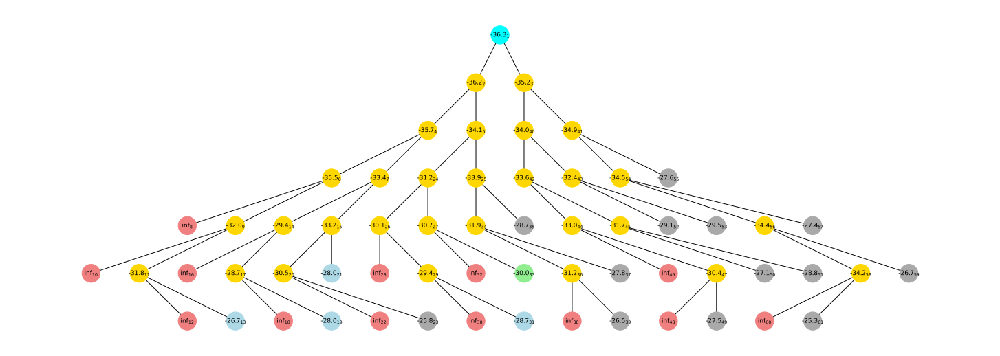

bnbpy
=====

A generic, configurable Python framework for solving optimization problems
using Branch & Bound. Also supports Column Generation and Branch & Price.

See here a quick overview of the package with:

* :ref:`Installation instructions <installation>`
* :ref:`Basic usage examples <basic_usage>`.

For a detailed documentation of the core components,
please refer to :doc:`this section <bnbpy>`.

This is how a search tree might look like
for a simple problem solved with bnbpy:

.. _installation:

Installation
------------

Install the package from PyPI:

.. code-block:: bash

   pip install bnbpy

Alternatively, clone the repository and install without extras:

.. code-block:: bash

   git clone https://github.com/bruscalia/bnbpy.git
   cd bnbpy
   python -m pip install .

Or with the ``dev`` extra for tests and linters:

.. code-block:: bash

   python -m pip install .[dev]

.. _basic_usage:

Basic Usage
-----------

Remember in this documentation you can find more detailed examples in the *Usage section*. Especially, the :doc:`machine deadline example <Usage/machine-deadline>` is a good starting point to understand how to implement your own problem and apply Branch & Bound from scratch.

Branch & Bound
~~~~~~~~~~~~~~

.. code-block:: python

   from bnbpy import BranchAndBound, Problem

   class MyProblem(Problem):
       # Define your problem specifications by implementing abstract methods

       def calc_bound(self):
           # Compute node lower bound
           pass

       def is_feasible(self):
           # Verify if node is feasible in the complete problem
           pass

       def branch(self):
           # Return a list of subproblems if not fathomed
           pass

   # Apply Branch & Bound
   problem = MyProblem()
   bnb = BranchAndBound(problem)
   bnb.solve()
   print(bnb.solution)

Branch & Price
~~~~~~~~~~~~~~

.. code-block:: python

   import bnbpy as bbp

   class MyMaster(bbp.Master):
       def __init__(self, *args):
           # Implement your master problem
           pass

       def add_col(self, c) -> bool:
           # Include a new column and return True if accepted
           return True

       def solve(self) -> bbp.MasterSol:
           # cost = ...
           # duals = ...
           # return MasterSol(cost=cost, duals=duals)
           pass

   class MyPricing(bbp.Pricing):
       def __init__(self, **kwargs):
           super().__init__(**kwargs)
           # Instantiate your pricing problem

       def set_weights(self, c):
           # Modify the instance by incorporating new weights
           pass

       def solve(self) -> bbp.PriceSol:
           # red_cost = ...
           # new_col = ...
           # return PriceSol(red_cost=red_cost, new_col=new_col)
           pass

   class MyCG(bbp.ColumnGenProblem):
       def __init__(self, **kwargs):
           master = MyMaster()
           pricing = MyPricing(**kwargs)
           super().__init__(
               master=master,
               pricing=pricing,
           )

       def branch(self) -> list['MyCG'] | None:
           # Create children
           pass

       def is_feasible(self) -> bool:
           # Check for feasibility in the complete formulation
           pass

Contact
-------

For any questions, suggestions or contributions,
please open an issue or a pull request on the
GitHub repository: `bnbpy on GitHub <https://github.com/bruscalia/bnbpy>`_.

.. toctree::
   :maxdepth: 1
   :caption: Usage:
   :hidden:

   Usage/machine-deadline
   Usage/maxclique
   Usage/cutting-stock
   Usage/milp
   Usage/pfssp
   Usage/easy-callbacks

.. toctree::
   :maxdepth: 1
   :caption: Package:
   :hidden:

   class_diagram
   bnbpy
   bnbpy.colgen
